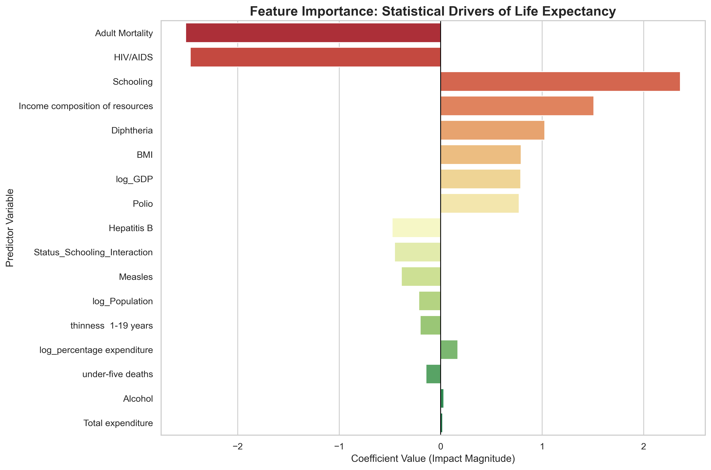
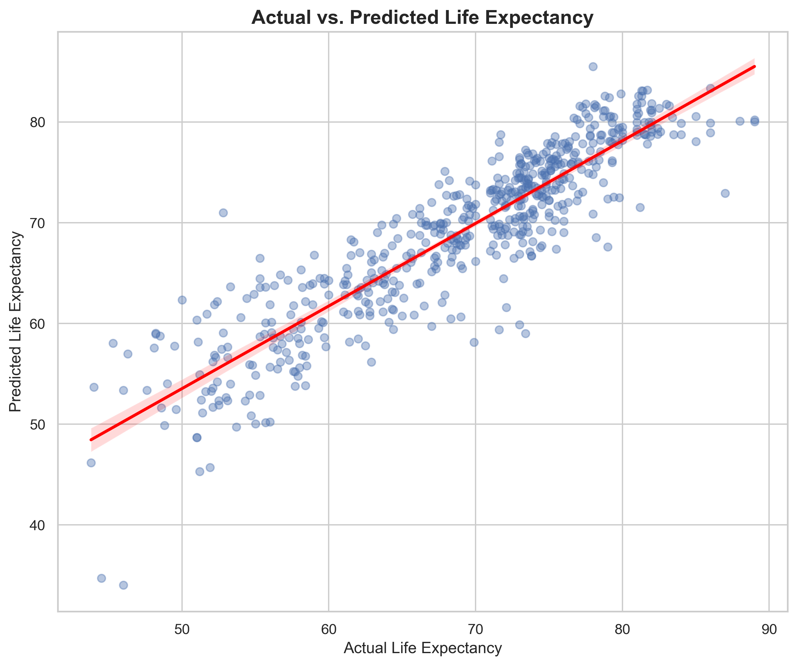
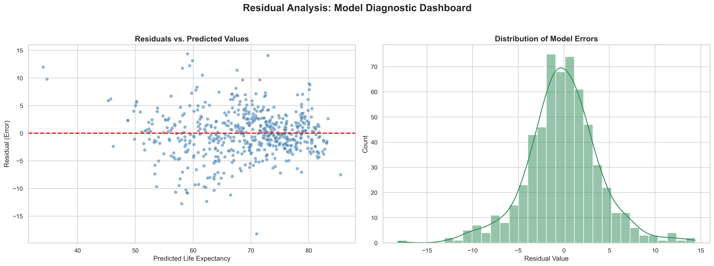

# Global Longevity: A Machine Learning Approach to Socio-Economic Health Drivers

## Project Overview
This project investigates the primary drivers of global life expectancy using a 15-year longitudinal dataset of 193 countries (From WHO). By integrating clinical indicators (vaccination rates, mortality) with socio-economic features (schooling, GDP), this analysis builds a predictive engine to quantify the Return on Health for different national interventions.

The project transitions from raw, high-missingness data to a refined Multiple Linear Regression model that explains over **81%** of global variance in longevity.

## Key Insights
* **The "Social Vaccine" (Education):** `Schooling` is the strongest positive predictor of health. The model identifies a "buffer effect" where education significantly mitigates the impact of adult mortality in developing nations.
* **Clinical Anchors:** `Adult Mortality` and `HIV/AIDS` remain the primary anchors pulling down national life expectancy, serving as the most immediate targets for clinical intervention.
* **Economic Non-Linearity:** Raw wealth (GDP) shows diminishing returns; after a baseline economic threshold is met, educational attainment and immunization coverage become more powerful predictors of longevity.

## Technical Workflow

### 1. Data Hardening & Cleaning
* **Advanced Imputation:** Handled systematic missingness (MAR) using **Grouped Medians** (by Country/Status) and **KNN Imputation** for economic features to preserve regional health signatures.
* **Interpolation:** Utilized linear interpolation for time-series features like `Population` to respect national growth trends.
* **Sanitization:** Corrected logical inconsistencies in health expenditure and vaccination data.

### 2. Feature Engineering
* **Multicollinearity Resolution:** Dropped redundant features (e.g., `infant deaths` and `thinness 5-9 years`) identified through correlation matrices (r > 0.90).
* **Normalization:** Applied **Log-transformations** (log1p) to heavily skewed distributions of GDP and Population.
* **Interaction Terms:** Developed a `Status × Schooling` interaction feature to capture how educational impact varies across different economic development tiers.
* **Standardization:** Utilized `StandardScaler` to ensure the model was not biased by the varying magnitudes of clinical vs. demographic data.

### 3. Predictive Modeling & Evaluation
A Multiple Linear Regression baseline was established with the following results:
* **R-squared ($R^2$):** 0.8132 (Explains 81.3% of variance).
* **Mean Absolute Error (MAE):** 2.97 years (Average prediction error).
* **Residual Analysis:** Validated normality and homoscedasticity to ensure the model is not systematically biased.

## Visualization Highlights
* **Feature Importance Plot:** Visualizing the statistical leverage of each driver.

* **Actual vs. Predicted Plot:** Demonstrating model reliability across different life expectancy tiers.

* **Residual Diagnostic Dashboard:** Confirming the randomness of model errors.


## Installation & Usage
1.  **Clone the Repository:**
    ```bash
    git clone https://github.com/yourusername/global-longevity-ml.git
    ```
2.  **Install Dependencies:**
    ```bash
    pip install -r requirements.txt
    ```
3.  **Run the Analysis:**
    Open the Jupyter Notebook in the `/notebooks` folder or execute the main processing script.

## Future Work
* **Oncology Integration:** Extending the model to investigate how these same socio-economic drivers predict cancer survival rates as nations transition from infectious to non-communicable disease burdens.
* **Regional Sub-modeling:** Developing specialized models for specific geographic clusters (e.g., Sub-Saharan Africa vs. OECD nations) to identify localized health stressors.

## Author
**Ibrahim Aremu Mikail**
*Clinical and Public Health Data Scientist | AI & ML in Healthcare*

## License
This project is licensed under the MIT License - see the `LICENSE` file for details.
